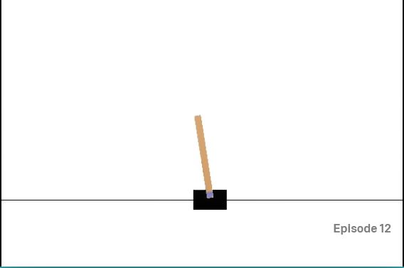

> Double DQN OpenAI Gym Cartpole 

Project developed by : 
    * Khaled AIECH
    * Alaeddine JOHMANI

  In this project, we implemented the Double Deep QNetwork reinforcment learning algorithm on 
  the CartPole-v0 openAI Gym environment.
  
  
  

The gym library is a collection of test problems — environments — that you can use to work out your reinforcement learning algorithms. These environments have a shared interface, allowing you to write general algorithms.

To install it, you need to have at least Python 3.5+ installed. Simply install gym using pip :  
    `pip` install gym
    
    
The OpenAI Gym Cartpole-v0 environment description :  
  
      A pole is attached by an un-actuated joint to a cart, which moves along
        a frictionless track. The pendulum starts upright, and the goal is to
        prevent it from falling over by increasing and reducing the cart's
        velocity.  
          
          
We tested the work, and obtained the following result plot: 

  

PS : In order to test the work, you need to install these following python libraries :   
* gym
* torch
* numpy
* matplotlib
* collections
* random
